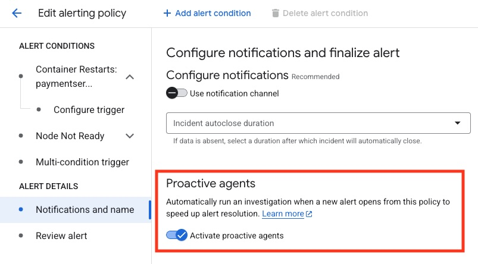

# Cloud Assist & Cost Analysis Demo

This workspace provides a repeatable, automated environment for demonstrating Google Cloud Assist investigations and Cost Analysis using the [Online Boutique](https://github.com/GoogleCloudPlatform/microservices-demo) sample application.

## Overview

The scripts in this directory automate the lifecycle of a GKE Autopilot cluster and the deployment of the Online Boutique microservices. This setup is designed to be easily reproducible for demos, performance testing, and cost optimization scenarios.

## Prerequisites

- [Google Cloud SDK (gcloud)](https://cloud.google.com/sdk/docs/install)
- [Terraform](https://developer.hashicorp.com/terraform/downloads)
- [kubectl](https://kubernetes.io/docs/tasks/tools/)
- An active Google Cloud Project with billing enabled.

## Quickstart

### 1. Initialize Submodules
This repository uses git submodules. Ensure they are initialized and updated before deploying:

```bash
git submodule update --init --recursive
```

### 2. Configure Project
Ensure your local `gcloud` context is set to the correct project:

```bash
gcloud config set project [YOUR_PROJECT_ID]
```

### 3. Deploy the Environment
Run the deployment script. This will enable necessary APIs, provision a GKE Autopilot cluster via Terraform, configure **Cloud Service Mesh (CSM)**, and deploy the application with Istio sidecar injection enabled.

```bash
./deploy.sh
```

*By default, this deploys to `us-central1` with the cluster name `online-boutique-demo` in the `online-boutique-demo` namespace.*

### 4. Check Status
Monitor the health of your deployment, verify service mesh status, and get the external IP for the Istio Gateway:

```bash
./status.sh
```

### Accessing the Application

Once the deployment is complete, the application will be accessible via the **Istio Gateway** external IP.

1.  Run `./status.sh`.
2.  Look for the **"Frontend is LIVE at"** message at the bottom of the output.
3.  Copy the URL (e.g., `http://35.247.123.146`) into your browser.

*Note: It may take 3-7 minutes for the Cloud Service Mesh to be provisioned and the External IP to be assigned to the Gateway after the first deployment.*

### 5. Monitoring & Alerting (Optional)
You can set up a Google Cloud Monitoring alert policy to detect failures in the cluster, such as container crashes or node failures. This is highly recommended for the Reliability demo.

```bash
./scenarios/setup-crash-alert.sh
```
*This script creates an alert policy that triggers if the `paymentservice` enters a crash loop or if a GKE node goes down.*

> [!IMPORTANT]
> **Manual Configuration Required:** After running the script, you must navigate to the Google Cloud Console, locate the "Payment Service Health Alert" policy, and edit it to enable **Proactive agents**.
> 
> Under the **Notifications and name** section, ensure that **Activate proactive agents** is toggled ON:
> 
> 

### 6. Cleanup
To avoid ongoing costs, tear down the infrastructure when finished. Note that this will also remove the Service Mesh configuration, fleet registration, and any custom alert policies:

```bash
./destroy.sh
```

## Configuration

You can override default settings using command-line flags:

| Flag | Description | Default |
|----------|-------------|---------|
| `--project=ID` | GCP Project ID | Active gcloud project |
| `--region=NAME` | GCP region for deployment | `us-central1` |
| `--cluster=NAME` | Name of the GKE cluster | `online-boutique-demo` |
| `--namespace=NAME` | K8s namespace for the app | `online-boutique-demo` |
| `--memorystore=BOOL` | Use Cloud Memorystore (Redis) | `false` |

**Example:**
```bash
./deploy.sh --region=europe-west1 --namespace=prod --cluster=my-demo-cluster
```

Run any script with `--help` to see all available options.

### Kubernetes Authentication

The scripts in this repository (including those in the `scenarios/` directory) automatically attempt to authenticate with the GKE cluster using `gcloud container clusters get-credentials`.

If you need to authenticate manually, you can run:
```bash
gcloud container clusters get-credentials online-boutique-demo --region us-central1 --project [YOUR_PROJECT_ID]
```

All scripts support common flags to specify the cluster details:
- `--project=ID`
- `--region=NAME`
- `--cluster=NAME`
- `--namespace=NAME`

### 4. Load Testing

The application includes a built-in `loadgenerator` using [Locust](https://locust.io/).

**View Traffic Logs:**
```bash
kubectl logs -f deployment/loadgenerator -n online-boutique-demo
```

**Scale the Load:**
Use the provided script to simulate high traffic. This is perfect for demonstrating GKE Autopilot's auto-scaling and monitoring cost increases.
```bash
# Scale to 200 users spawning at 10 users/sec
./scenarios/scale-load.sh 200 10
```

## SRE Investigation Scenarios

This workspace includes three scripts in the `scenarios/` directory to inject failures for SRE investigation training and RCA demos.

### 1. Latency (CPU Throttling & Artificial Delay)
Induces significant latency in the `productcatalogservice` using both CPU throttling and an artificial delay.
- **Inject:** `./scenarios/inject-latency.sh`
- **Symptoms:** Slow product loading on the frontend (3+ second delay).
- **Investigate Logs:**
  ```bash
  # Check for high latency (3000ms+) in the frontend logs
  kubectl logs -l app=frontend -n online-boutique-demo | grep "took_ms"
  ```
- **Note:** On GKE Autopilot, the CPU limit will be adjusted to the minimum of 100m.

### 2. Connectivity (Network Isolation)
Blocks all incoming traffic to the `cartservice` using a Kubernetes `NetworkPolicy`.
- **Inject:** `./scenarios/inject-network-failure.sh`
- **Symptoms:** "Error: Could not reach frontend - Status code: 500" errors on the frontend.
- **Investigate Logs:**
  ```bash
  # Look for connection timeouts to the cartservice
  kubectl logs -l app=frontend -n online-boutique-demo | grep "cartservice"
  ```

### 3. Reliability (CrashLoopBackOff)
Causes the `paymentservice` to fail on startup by injecting an invalid configuration.
- **Inject:** `./scenarios/inject-crash.sh`
- **Symptoms:** Checkout failures; `paymentservice` pods show `CrashLoopBackOff`. If the alert policy is configured, it will trigger an incident.
- **Investigate Logs:**
  ```bash
  # Check checkoutservice for payment failures
  kubectl logs -l app=checkoutservice -n online-boutique-demo
  # Check paymentservice logs for startup errors
  kubectl logs -l app=paymentservice -n online-boutique-demo
  ```

### Restore Environment
To fix all issues and return the application to a healthy state:
```bash
./scenarios/restore.sh
```

## Security & Best Practices

- This demo uses **GKE Autopilot** by default, which is highly efficient for usage-based cost analysis.
- The `deploy.sh` script automatically enables the `serviceusage.googleapis.com` and `cloudresourcemanager.googleapis.com` APIs.
- Ensure you have the `Owner` or `Editor` role on the target GCP project for successful deployment.
